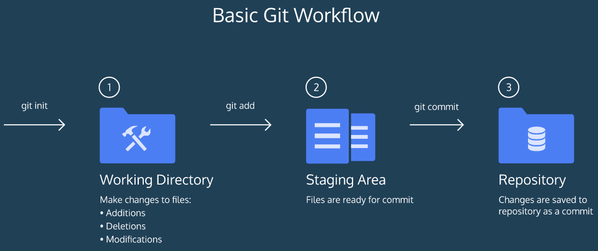
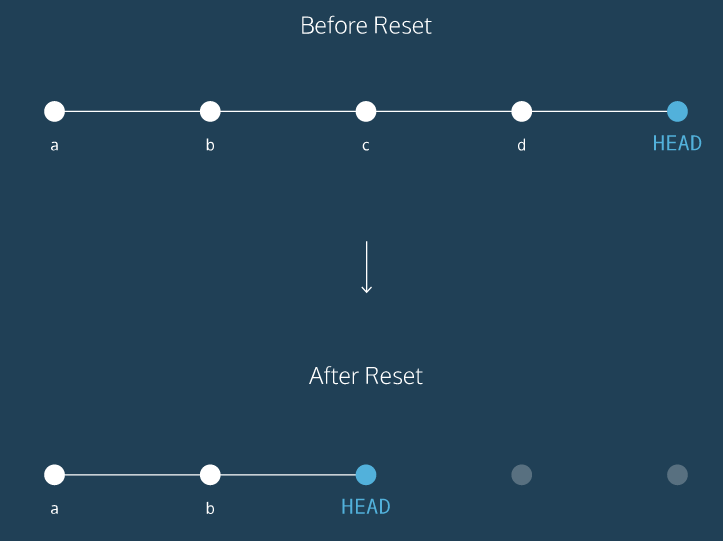

This is a basic git tutorial made exclusively for first year SMVDU students.  
### DEFINITION
Git is a software that allows you to keep track of changes made to a project over time. Git works by recording the changes you make to a project, storing those changes, then allowing you to reference them as needed.  
### BASIC GIT WORKFLOW  
#### Git Workflow

A git project can be divided into three parts:- 

1. **Working Directory** - This is the folder where we create, edit, delete and organize files.
2. **Staging Area** - Changes that we make in the working directory are listed here.
3. **Repository** - Git permanently stores those changes as different versions of the project.  

The Git workflow consists of editing files in the working directory, adding files to the staging area, and saving changes to a Git repository. In Git, we save changes with a commit.  
#### Git Commands  
**1.**`git init` - The word `init` means initialize. The command sets up all the tools Git needs to begin tracking changes made to the project.  
**2.**`git status` - We can check the status of the changes made to the contents of the working directory with this command.  
**3.**`git add filename` or `git add .` - Our files need to be added to the staging area in order for git to start tracking them.  
**4.**`git diff filename` - We can check the differences between the files in the working directory and the staging area with this command.  
**5.**`git commit -m "your commit message"` - A commit is the last step in our Git workflow. This permanently stores file changes from the staging area in the repository.  
Rules for commit messages :-  
- Should be brief
- Must be in quotation marks
- Written in the present tense  

**6.**`git log` - Used to refer back to an earlier version of a project.  
### BACKTRACKING IN GIT  
#### Introduction  
When working on a Git project, sometimes we make changes that we want to revert or get rid of. Git offers a few eraser-like features that allow us to undo mistakes during project creation.  
#### Git Commands  
**1.**`git show HEAD` - In Git, the commit you are currently on is known as the HEAD commit. In many cases, the most recently made commit is the HEAD commit.   
**2.**`git checkout HEAD filename` - This will restore the file in your working directory to look exactly as it did when you last made a commit.  
**3.**`git reset HEAD filename` - We can unstage files from the staging area using this command. It resets the file in the staging area to be the same as the HEAD commit. It does not discard file changes from the working directory, it just removes them from the staging area.  
**4.**`git reset commit_SHA` - This command works by using the first 7 characters of the SHA of a previous commit. `HEAD` is now set to that previous commit.  

    

### GIT BRANCHING  
#### Introduction  
Till now we worked in a single branch called `master`. Git allows us to create branches to experiment with versions of a project. We can create a new branch and make some changes to that branch only. It will have no effect on the `master` branch until we merge our new branch to the `master` branch. `new_branch` is a different version of the Git project. It contains commits from `master` but also has commits that `master` does not have.

  

#### Git Commands  
**1.**`git branch` - It is used to find the branch which you are on. The `*` shows you what branch you are on.  
**2.**`git branch new_branch` - This is used to create a new branch. Name your branch something that describes the purpose of the branch. Branch names cannot contain whitespaces.  
**3.**`git checkout branch_name` - 